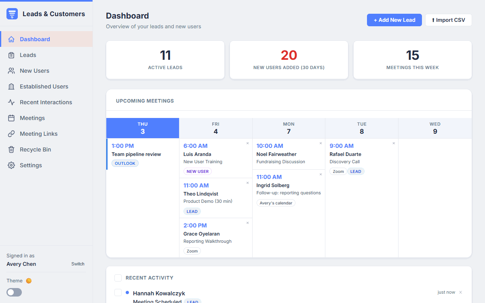
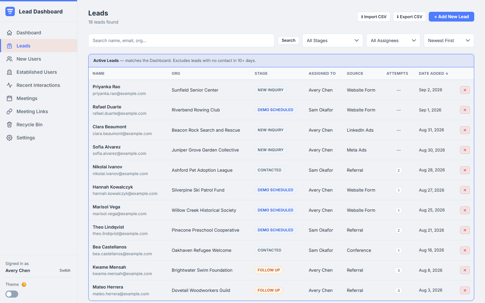
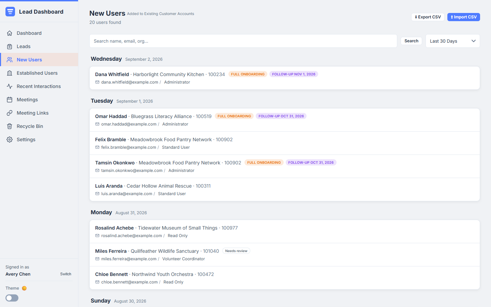
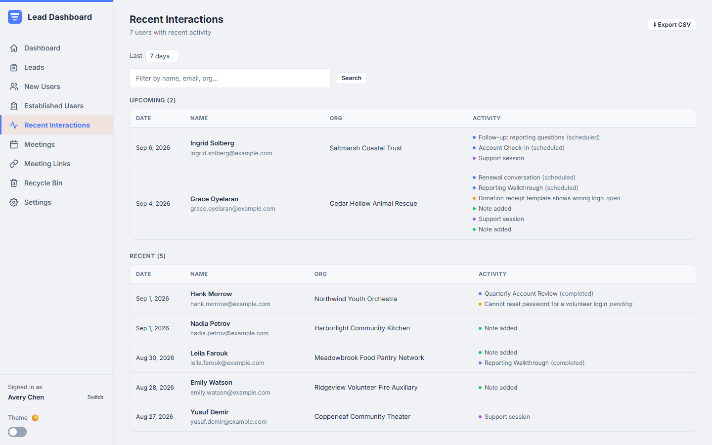
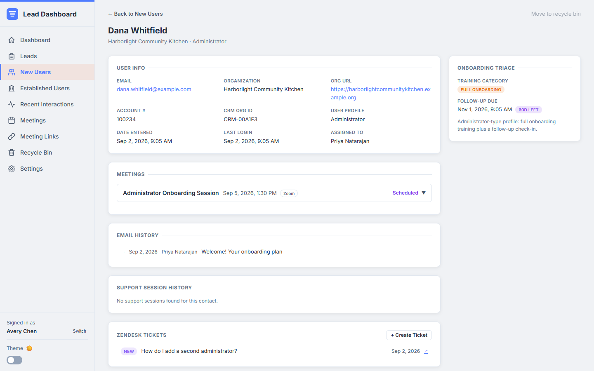

# Lead Management & Customer Activity Dashboard

An internal sales and onboarding tool that tracks leads through a pipeline, triages new users on customer accounts, and pulls meetings, tickets, and support sessions into one view of each customer.

<!-- DEMO GIF PLACEHOLDER: record docs/demo.gif against the seeded app and remove this comment. -->


| Leads pipeline | New users with triage flags |
| --- | --- |
|  |  |

| Consolidated customer activity | One customer, every touchpoint |
| --- | --- |
|  |  |

Two more views are in [docs/screenshots](docs/screenshots): the dashboard and the meetings list.

**Suggested GIF click path (30 to 45 seconds):** start on the Dashboard and point at the week strip of upcoming meetings. Open Leads, click a lead in the Contacted stage, and click the next stage on the pipeline bar. Go to New Users, open an administrator flagged "Full onboarding", and show the follow-up deadline and the Zoom meeting on the detail page. Finish on Recent Interactions and hover a row to show the mix of meetings, tickets, notes, and support sessions.

## What it does

- **Leads.** A pipeline with five fixed stages (New Inquiry, Contacted, Demo Scheduled, Follow Up, Converted) plus Lost and team-defined terminal stages such as Test or Spam. Each lead has notes, an activity log, a contact-attempt counter, and its meetings. Leads can be added by hand, submitted from a public web form, or bulk imported from an ad-platform CSV with duplicate detection.
- **New Users.** People added to existing customer accounts, imported daily from a CSV on a shared drive. The list groups them by day and shows the triage result for each one.
- **Auto-triage.** Every imported user gets a training category from a configurable profile-to-category map. Administrator-type profiles are flagged for full onboarding training and get a follow-up deadline 60 days out. Standard profiles get a standard welcome. Unknown profiles are marked for review. The rule lives in one small module, [src/triage.js](src/triage.js), and the map is editable in Settings.
- **Established Users.** Everyone outside the new-user window, searchable for demos, meetings, and notes.
- **Meetings.** Background pollers read Calendly, Zoom, and Outlook calendars, match attendees to leads and users by email, and write everything into one meetings table. A newly discovered meeting advances the lead or user; a cancellation moves them back. Duplicates across sources are collapsed.
- **Helpdesk sync.** Converting a lead finds or creates the organization and user in the helpdesk (Zendesk) before the conversion is saved. A separate poller caches recent tickets so they show on the customer's page.
- **Recent Interactions.** A consolidated view of established customers with any activity in the last N days: meetings, notes, status changes, helpdesk tickets, and support sessions, all in one table.
- **Also included.** Dashboard with stat cards and a five-day meeting strip, CSV export on every list, a recycle bin with a seven-day purge, note topics, per-user attribution, dark mode, and URL-hash routing so the back button works.

## Why it exists

The sales, marketing, and training team at a SaaS company needed to track leads, new users, demos, and onboarding follow-ups. Paid CRM seats for every team member cost more than the workflow justified. This app replaced those seats with a small purpose-built tool that reads from the systems the team already used. It ran on an internal network for a full year of daily use.

This repository is a public version of that app. All data is fictional and every external integration runs against a mock adapter by default.

## How it is built

| Layer | Technology |
| --- | --- |
| Frontend | React 19 (Create React App), no router library, CSS variables for theming |
| Backend | Node.js 20+, Express 5 |
| Database | SQLite via better-sqlite3, WAL mode |
| Scheduling | node-cron pollers inside the API process |
| Tests | Node's built-in test runner for the API and triage rule |

The API is one Express process. Shared SQL fragments (the new-user window, the last-activity subquery, the active-lead rule) live at the top of [src/server.js](src/server.js) and are reused by every route that needs them.

**Adapter pattern for integrations.** Each external system has a folder under [src/integrations](src/integrations) with two files that export the same functions: `real.js` calls the vendor API with credentials from `.env`, and `mock.js` returns canned data from `fixtures/`. The registry in [src/integrations/index.js](src/integrations/index.js) loads one or the other based on `MOCK_INTEGRATIONS`. Route handlers and pollers only ever import the registry, so swapping real and mock is one environment variable. Fixtures store times as offsets from now, so the mock data always looks current.

## Integrations

| System | What it does here | Real adapter | Mock adapter |
| --- | --- | --- | --- |
| Calendly | Polls scheduled and canceled events every 5 minutes, matches invitees to leads and users, advances or reverts their stage | Personal access tokens, one or more accounts | Six fixture events including one cancellation |
| Zoom | Polls upcoming and past meetings every 5 minutes and matches participants the same way | Server-to-Server OAuth app | Four fixture meetings |
| Outlook (Microsoft Graph) | Polls team members' calendars every 5 minutes; shows email subject lines exchanged with a contact (metadata only, never bodies) | App registration with client credentials | Fixture events and messages |
| Shared drive CSV (Microsoft Graph) | Downloads the daily new-user export on startup and every 2 hours, imports new rows, runs triage | Site id and file path on the drive | Reads [data/sample/new-users-import.csv](data/sample/new-users-import.csv) with dates shifted to yesterday |
| Zendesk | Creates the organization and user when a lead converts; caches recent tickets every 30 minutes; creates tickets from a customer's page | OAuth client credentials | In-memory helpdesk seeded from a fixture |
| Support sessions | Pulls session history from a sibling internal support-notes app every 30 minutes | REST API of that app | Six fixture sessions |

The public version runs against the mock adapters. The real adapters are the code that ran in production, with endpoints and credentials moved to environment variables. Zoom is the exception: its real adapter is wired the same way but has only been exercised through the mock.

## Quickstart

Requires Node.js 20 or newer and npm.

```bash
git clone https://github.com/RonRadzai/lead-customer-dashboard.git
cd lead-customer-dashboard
npm install
npm run seed
npm run dev
```

Open http://localhost:3000 and pick any name in the "Who are you?" prompt. That is it. No `.env` file is needed; the app defaults to mock integrations and creates `data/app.db` from the seed.

What the scripts do:

| Script | Purpose |
| --- | --- |
| `npm run seed` | Delete and rebuild the database with fictional, deterministic sample data |
| `npm run dev` | Start the API (port 3002) and the React dev server (port 3000) together |
| `npm run server` | API only. Serves the built UI too if `build/` exists |
| `npm run build` | Production build of the frontend into `build/` |
| `npm run test:server` | API smoke tests and triage unit tests |
| `npm run screenshots` | Regenerate the README screenshots with a headless browser against a running instance |

## Configuration

Copy [.env.example](.env.example) to `.env` and fill in only what you need. Every variable has a placeholder and a comment. The important ones:

- `MOCK_INTEGRATIONS` defaults to true. Set it to false to call real APIs. Any integration without credentials is skipped, not failed.
- `FOLLOW_UP_DEADLINE_DAYS` (60), `NEW_USER_WINDOW_MONTHS` (6), and `STALE_LEAD_DAYS` (10) tune the business rules.
- `DB_PATH` moves the SQLite file. `PORT` changes the API port.
- The remaining variables are credentials and base URLs for Calendly, Zoom, Zendesk, Microsoft Graph, and the support-notes app.

## Project structure

```
src/
  server.js              Express API, pollers, CSV import, business rules
  database.js            SQLite schema, indexes, reference data
  triage.js              Auto-triage rule for imported users
  csv.js                 CSV parsing helpers
  integrations/
    index.js             Picks real or mock adapters
    calendly/            real.js, mock.js
    zoom/                real.js, mock.js
    zendesk/             real.js, mock.js
    microsoft-graph/     real.js, mock.js (Outlook calendar, mail metadata, shared-drive file)
    support-sessions/    real.js, mock.js
    fixtures/            Canned payloads used by the mocks
  components/            React views (Dashboard, LeadsList, LeadDetail, NewUsersList, ...)
  utils/format.js        Date and label formatting
data/
  sample/                organizations.csv and new-users-import.csv (fictional)
  app.db                 Created by `npm run seed`, ignored by git
scripts/
  seed.js                Deterministic sample data
  screenshots.js         Headless-browser screenshots for the README
test/                    API smoke tests and triage unit tests
docs/screenshots/        Images used in this README
```

## Roadmap

- Static demo mode on GitHub Pages: a build of the frontend that runs against baked-in mock data, so the app can be clicked through without running a server.
- Email reminders for overdue onboarding follow-ups and stale leads.
- Webhooks from Calendly and Zoom instead of polling.

## License

MIT. See [LICENSE](LICENSE).
